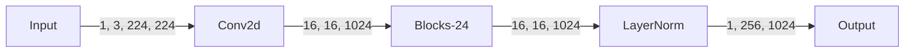
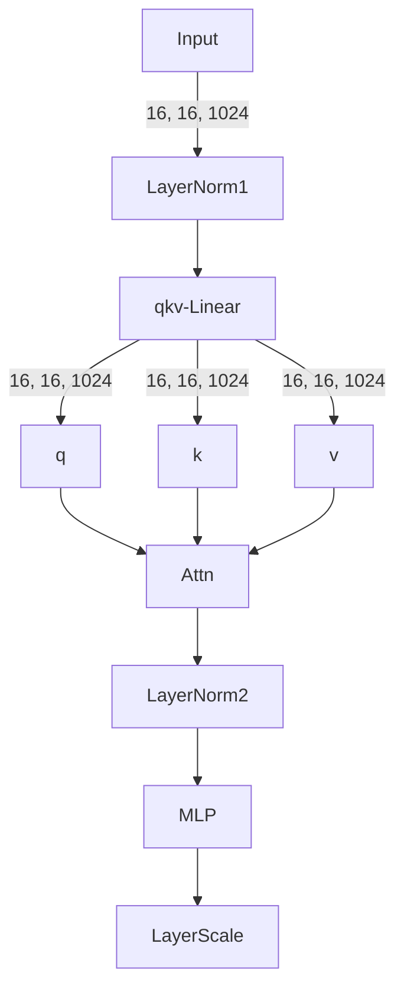
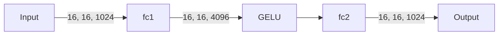
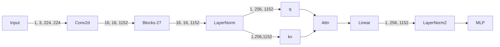
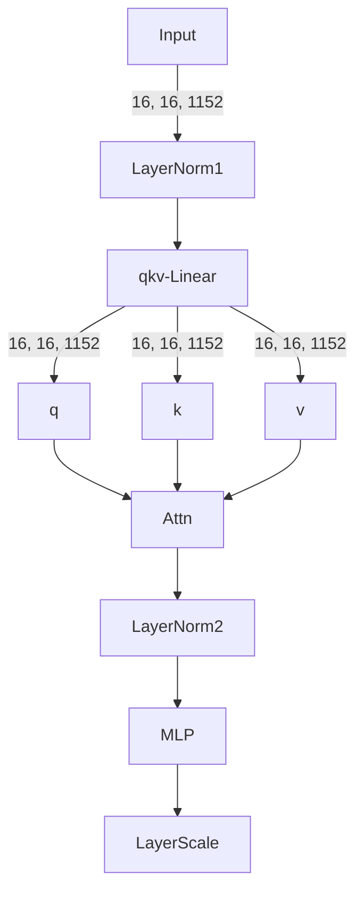
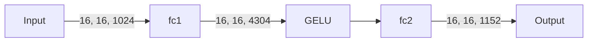
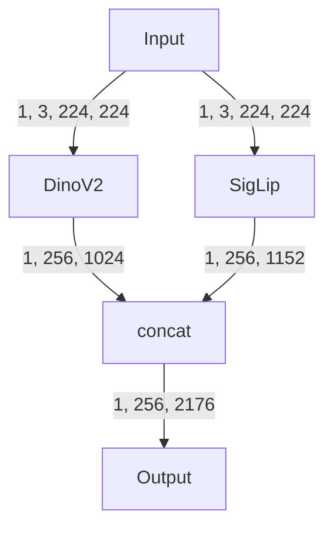
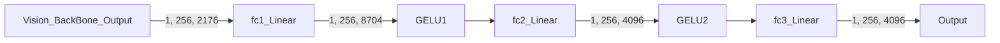

- ```py
  vla = AutoModelForVision2Seq.from_pretrained(
    "openvla-7b", 
    # attn_implementation="flash_attention_2",  # [Optional] Requires `flash_attn`
    torch_dtype=torch.bfloat16, 
    low_cpu_mem_usage=True, 
    trust_remote_code=True,
    device_map='auto'
  )
  ```
  加载的是`/home/nipeihuan/Researchs/openvla_2/openvla-7b/modeling_prismatic.py`
  第492行
  ```python
  class OpenVLAForActionPrediction(PrismaticForConditionalGeneration):
  ```
  依据是在`openvla-7b`的`config.json`的第6行开始
  ```py
    "auto_map": {
      "AutoConfig": "configuration_prismatic.OpenVLAConfig",
      "AutoModelForVision2Seq": "modeling_prismatic.OpenVLAForActionPrediction"
    }
  ```
  可以看到class的名字和这个`auto_map`里配置的是一样的，也就是说只要写的是`AutoModelForVision2Seq`，就会加载这个模型

​	

- 通过修改上面说的`OpenVLAForActionPrediction`可以看到**VLM**的输出。具体是这样：

  ```python
  def predict_action(
          self, input_ids: Optional[torch.LongTensor] = None, unnorm_key: Optional[str] = None, **kwargs
      ) -> np.ndarray:
          """Thin wrapper around .generate() that decodes predicted actions and unnormalizes them."""
          # We need to add this special empty token ('') after the colon (':') token in "ASSISTANT:"
          # in order for the predictions to match the training configuration and be accurate.
          input_ids = torch.cat(
              (input_ids, torch.unsqueeze(torch.Tensor([29871]).long(), dim=0).to(input_ids.device)), dim=1
          )
  
          # Run VLA inference
          generated_ids = self.generate(input_ids, max_new_tokens=self.get_action_dim(unnorm_key), **kwargs)
          
          # Extract predicted action tokens and translate into (normalized) continuous actions
          predicted_action_token_ids = generated_ids[0, -self.get_action_dim(unnorm_key) :].cpu().numpy()
  # print("!!!!!!!!!!!!!!!!!!!!!!!!!!!!!!!!!!!!!!!!!!!!!!!!!!!!!!!!!!!!!!")
  # 定义一个属性，这样在demo.py中就能调用出来
          self.predicted_action_token_ids = predicted_action_token_ids
  # print("!!!!!!!!!!!!!!!!!!!!!!!!!!!!!!!!!!!!!!!!!!!!!!!!!!!!!!!!!!!!!!")
          discretized_actions = self.vocab_size - predicted_action_token_ids
          discretized_actions = np.clip(discretized_actions - 1, a_min=0, a_max=self.bin_centers.shape[0] - 1)
          normalized_actions = self.bin_centers[discretized_actions]
  
          # Unnormalize actions
          action_norm_stats = self.get_action_stats(unnorm_key)
          mask = action_norm_stats.get("mask", np.ones_like(action_norm_stats["q01"], dtype=bool))
          action_high, action_low = np.array(action_norm_stats["q99"]), np.array(action_norm_stats["q01"])
          actions = np.where(
              mask,
              0.5 * (normalized_actions + 1) * (action_high - action_low) + action_low,
              normalized_actions,
          )
  
          return actions
  ```

  然后在`demo.py`中，实例出来一个`llama`的`tokenizer`，然后用`openvla`的`tokenizer.model`参数

  ```python
  tokenizer = Tokenizer("openvla-7b/tokenizer.model")
  predicted_action_token_ids = vla.predicted_action_token_ids.reshape(-1).tolist()
  print(predicted_action_token_ids)
  print(tokenizer.decode(predicted_action_token_ids))
  ```

  输出结果是

  ```shell
  [31868, 31878, 31857, 31972, 31883, 31902, 31744]
  庄˚ਿ교達米忠
  ```

  这样的原因可能是

  - 即使找对了输出，这个的方法是把最后几个不常用的token换成他的`VLA`中`ACTION`编码，所以看不出来
  
- [ ] ==还需要再找怎么获得`VLM`的输出，尤其注意modeling_prismatic的第517行self.generate在哪==

## Vision Encoder

### DinoV2



`Conv2d: in_channel = 3, out_channel = 1024, kernel_size = 14, stride = 14, padding = 0`

#### BLock



#### MLP



---

### SigLip



`Conv2d: in_channel = 3, out_channel = 1152, kernel_size = 14, stride = 14, padding = 0`

#### BLock



#### MLP



### Vision BackBone



### Projector



## PrismaticConditionalGeneration

在forward里面

当input ids的shape[1]是1时，（也就是generation阶段），他的input的形状是（1，1），然后past key values的形状是这样变化的（1，32，274，128）--> （1， 32， 275， 128） ……  -->（1， 32， 280， 128）

注意274 = 256 + 18 （其中18是用于演示的prompt的tokenizer之后的token数量）

32是注意力头数，128是head_dim, 32*128 =4096 就是llama2-7b的embed-size

text：输入的text就是token id的形式，然后经过input embed layer变成input embedding（1，18，4096）

img就是通过上面的处理变成（1，256，4096）

然后cat起来组合成（1，274，4096）

prismatic的输出第一次是1，274，32064，后面就是1，1，32064，一共输出6个1，1，32064和一个只取最后一个的1，274，32064

kv cache目前是none

这里的32064是vocab-size

在第一次，也就是输入1，274，32064，同样输出274个token id后，只取最后一个，kvcache就是1，32，274，128

第二次，输入上一个输出的token id，kvcache变成1，32，275，128，输出一个token id


然后通过一个函数把这7次forward包起来，并且把逐个生成的7个token id一起输出，然后用vocab size 减去这7个token id，并clip到0-255，然后把这个做一个归一化，前六个输出分别做一个`0.5 * (normalized_actions + 1) * (action_high - action_low) + action_low`，最后一个就是原封不动的输出，就是得到的actions，也就是最后结果

